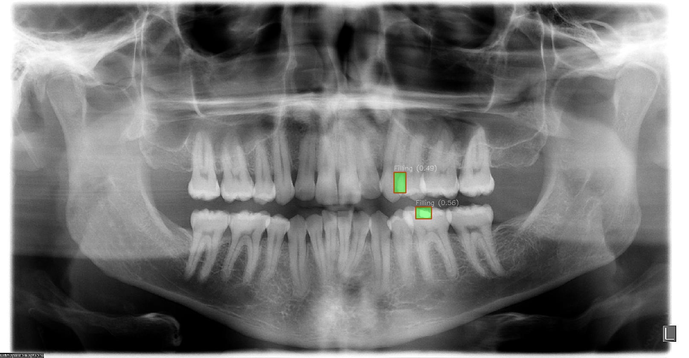

# Dental X-ray Analysis Report 

## Diagnosis

Based on the X-ray findings, it is likely that there are two dental fillings present.

## Recommended Treatment Plan

In accordance with the diagnosis, we recommend a treatment plan of dental filling removal and restoration to prevent further progression and restore normal function.

